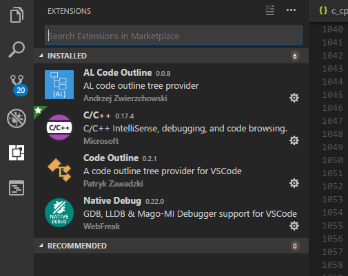
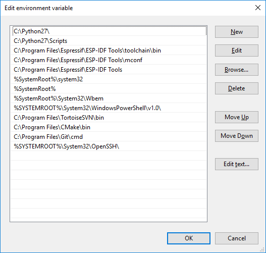
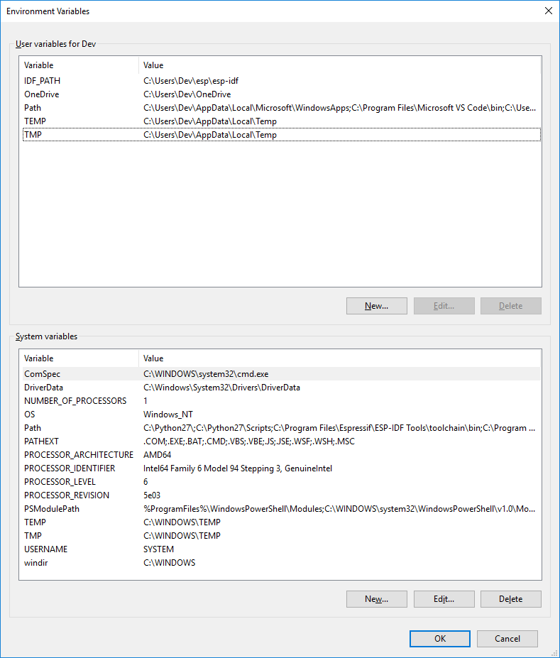

## Setting up Visual Studio Code for ESP32 IDF (FreeRTOS)


<p align="center">
  <a>
    <span width=50></span>
    
  </a>

  <h3 align="center">ESP32 IoT IDF</h3>

  <p align="center">
    Xtensa powerful framework for faster and easier IoT development.
  </p>
</p>

## Steps

- [Download and install VSC](#Download-and-install-VSC)
- [Install VSC Extensions](#Install-VSC-extensions)
- [Setup Toolchain](#Setup-toolchain)
- [Setup and verify environment variables](#Setup-and-verify-environment-variables)
- [Create project](#Create-project)

## Download and install VSC

Below link will point to the latest version of the Microsoft code editor which is free and open source.
Go ahead and download the latest release.

<a href="https://code.visualstudio.com/"><span>Visual Studio Code</span></a>


## Install VSC extensions

After the installation open editor and go to 'Extensions' section to browse all available vsc extensions
You need the following:

C++
Native Debug
Code Outline or AL Outline (to display and navigate properties)



## Setup toolchain

Next you need tools for compilation and linking your projects
Go to below link and follow instructions
https://docs.espressif.com/projects/esp-idf/en/feature-cmake/get-started/index.html#setup-toolchain

You need to download all-in-one esp-idf tools installer
<a href="https://dl.espressif.com/dl/esp-idf-tools-setup-1.1.exe">https://dl.espressif.com/dl/esp-idf-tools-setup-1.1.exe</a>
and get the latest ESP-IDF framework

<a href="https://docs.espressif.com/projects/esp-idf/en/feature-cmake/get-started/index.html#get-started-get-esp-idf">How to get ESP-IDF</a>

## Setup and verify environment variables

Make sure all path and idf variables are present and pointing to right locations
IDF_PATH is cruicial.
You can use run-command way to set them up with <u>setx IDF_PATH "...your path to esp-idf folder" </u>

Example setup:



## Create project

To create project that can properly compile you need the following:
### .vscode folder must be present in the root project directory

### .vscode folder must have the following files:
 - <a href=".vscode/c_cpp_properties.json">c_cpp_properties.json</a>
 - <a href=".vscode/settings.json">settings.json</a>
 - <a href=".vscode/tasks.json">tasks.json</a>

### to have key shortcuts you need to modify keybindings.json file
<a href="c_cpp_properties.json">keybindings.json</> is located in C:\Users\....your profile name.... \AppData\Roaming\Code\User
  This file will allow to run compilation etc with just pressing keyshortcut

### alternatively and what I recommend - use the command line from terminal to compile,monitor and run your app
- `idf.py -p COM3 flash` -- wil compile and flash the board on port COM3
- `idf.py -p COM3 monitor` -- will display live serial monitor in console

if you want to flash and immefiately monitor use 
- `idf.py -p COM3 flash monitor`

`buil`d will build project with changes
`fullclean` will erase old files and refresh the whole build for new compilation

## CMake 

To use CMake environment your project must contain just like Make files - CMakeLists.txt (in project directory)

It usually contains f.ex. below lines 

```
set(MAIN_SRCS
    main/spi_master_example_main.c
    main/pretty_effect.c
    main/decode_image.c)

include($ENV{IDF_PATH}/tools/cmake/project.cmake)
project(spi_master)
```

You can change them to the project files you have.
Follow the examples provided in examples folder together with idf framework that you downloaded
There are CMakeList.txt files in different folders that will help you how to add directories and component references

I will post more later on CMake... ;)


